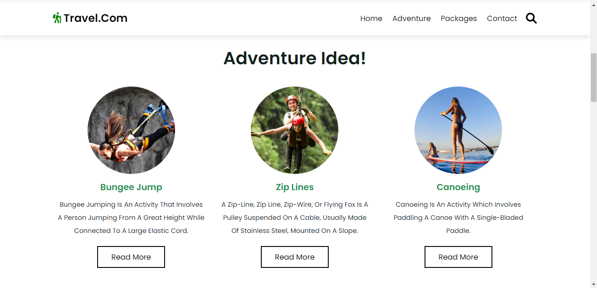
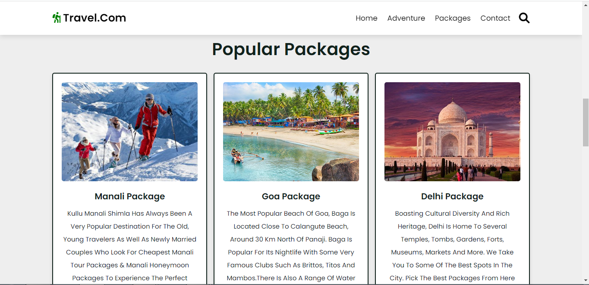
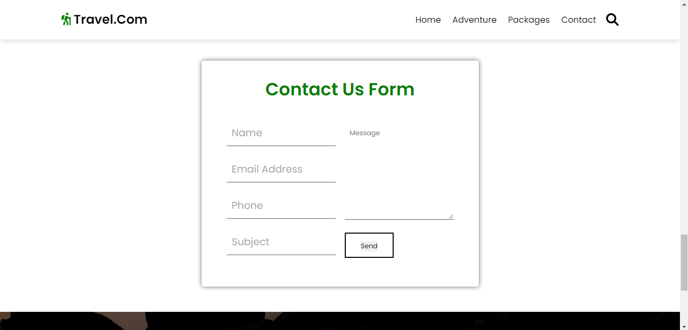
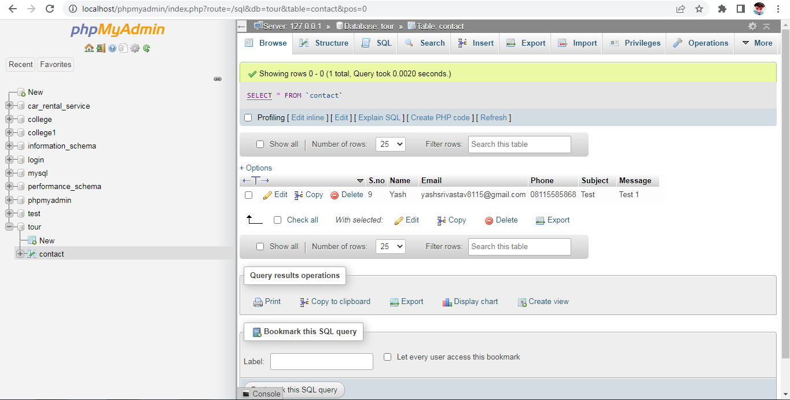

# 🌍 Tour & Travel Website

**A beautiful and responsive front-end landing page for a Tour & Travel agency.**

[**View Live Demo**](https://www.example.com) · [**Report Bug**](https://www.example.com) · [**Request Feature**](https://www.example.com)


This is a **Tour & Travel** front-end project designed to showcase beautiful destinations, packages, and services. It was built from scratch focusing on a clean, modern, and engaging user interface.

The website includes multiple sections such as:

- Home: A stunning landing area.
- Adventure & Packages: Beautifully displayed tour cards.
- Contact Us: A fully styled form. (Information is captured using a PHP backend).
---

## 🛠️ Built With

- **HTML5** (Semantic structure)
- **CSS3** (Responsive design, animations)
- **JavaScript** (Interactivity, DOM manipulation)
- **PHP** (Backend logic for the contact form)
---

## 🚀 Getting Started

### Prerequisites
- A modern web browser (Chrome, Firefox, Safari)
- Optional: A local server environment like XAMPP or MAMP if you want to test the PHP backend functionality.

### Installation
1. Clone the repo
```
git clone https://github.com/Yash-srivastav16/Tour-Project.git
```
2. Open `index.html` in your browser to view the frontend.
3. If testing PHP, move the project folder to your local server's `htdocs` (for XAMPP) or `www` directory, and navigate to `localhost/Tour-Project`.
---

## 📸 Screenshots

| Adventure Section | Tour Packages |
| :---: | :---: |
|  |  |

| Contact Form | Database View |
| :---: | :---: |
|  |  |
---

## 🤝 Contributing

**Calling All Open Source Contributors!** We would love your help in shaping the future of this repository.

1. Check out our [Contributing Guidelines](https://www.example.com) to get started.
2. Look at our [Open Issues](https://www.example.com) (look for the good first issue label!).
3. Fork the Project, create your Feature Branch (git checkout -b feature/AmazingFeature), and open a Pull Request.
---

## 📜 License

Distributed under the MIT License. See `LICENSE` for more information.